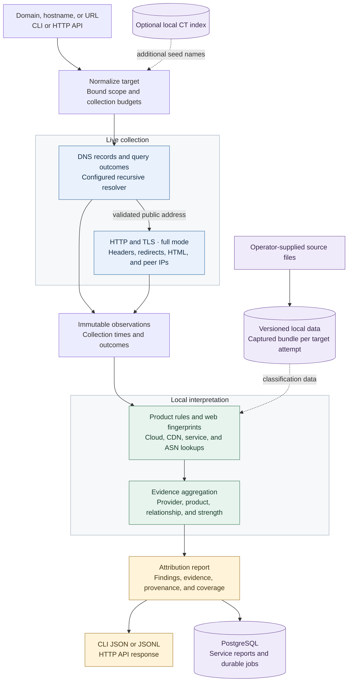

# cloudattrib

`cloudattrib` collects public evidence about the cloud infrastructure and SaaS products associated with a domain. It combines DNS records, bounded HTTP responses, local fingerprints, and IP datasets into a report with findings, supporting evidence, and coverage limits.

The reports support lead enrichment. They do not establish who pays for a service, qualify a lead, or estimate spend and savings.

## Run your first analysis

Install Go 1.25 or later and Make, then build from the repository root:

```sh
make build
./bin/cloudattrib analyze example.com
```

Domain analysis needs a recursive DNS resolver. The default is `127.0.0.1:53`. If your resolver listens elsewhere, set its address before running the command:

```sh
export CLOUDATTRIB_RESOLVER=192.168.1.1:53
./bin/cloudattrib analyze example.com
```

Replace that example address with your resolver. There is no automatic public-DNS fallback. The standalone CLI does not require PostgreSQL unless you enable CT discovery.

The command writes JSON to stdout and diagnostics to stderr. Missing local datasets allow DNS and HTTP evidence to survive in a partial report.

| Exit | Meaning |
| --- | --- |
| `0` | Requested work completed, including a complete no-match result. |
| `2` | Invalid command, configuration, input, or admission request. |
| `3` | At least one target was partial, failed collection, or was cancelled. |
| `4` | A necessary capability, requested bundle, or persistent store was unavailable, or startup failed. |

Read `coverage` alongside `findings`. An empty result from incomplete sources does not establish that a service is absent.

## Choose an operation

```sh
# DNS evidence and local enrichment, without website requests
./bin/cloudattrib analyze example.com --mode dns

# One output envelope per input row
./bin/cloudattrib batch --input domains.txt --format jsonl

# Offline IP lookup using local datasets
./bin/cloudattrib lookup-ip 198.51.100.7 --match all

# Reinterpret retained observations without collection
./bin/cloudattrib reclassify --report report.json --bundle builtin-rules-v1

# Start the API and durable job workers
./bin/cloudattrib serve --config config/example.yaml
```

`full` is the default analysis mode. It adds HTTP, TLS, and local web fingerprints to DNS and network enrichment. `lookup-ip` and `reclassify` make no collection requests. The IP above is a documentation address for offline examples.

## Add local data

The CLI loads an active bundle when one exists. Otherwise, it reads supported files from `./data/sources`. Set `data.source_directory` and `data.bundle_directory` in a configuration file to use other paths.

For ASN enrichment, place the decompressed IPtoASN files at:

```text
data/sources/iptoasn-v4.tsv
data/sources/iptoasn-v6.tsv
```

IPv4 files use unsigned integer interval endpoints; IPv6 files use textual addresses. Both use five tab-separated fields: start, end, ASN, country code, and description. The [source contracts](docs/source-contracts.md) list all supported inputs and their provenance requirements.

The application does not download or refresh data during startup or analysis. If some applicable sources are missing, lookup returns available results with partial coverage. If none is usable, it returns `capability_unavailable`.

For managed updates, follow [import, activation, rollback, and pruning](docs/operations.md#import-and-activate-data). An active bundle takes precedence over loose source files.

## Configure the application

`CLOUDATTRIB_CONFIG` selects one strict YAML or JSON configuration for CLI operations. The `--config` flags on `serve` and `datasets` override that path for the command.

`CLOUDATTRIB_RESOLVER` overrides the resolver address loaded at CLI startup. A command-specific configuration supplies its own resolver. See [config/example.yaml](config/example.yaml) for the complete configuration shape.

Certificate Transparency is optional and disabled by default. Analysis reads a local PostgreSQL CT index; it does not search public logs. See [CT operations](docs/ct-operations.md) to enable discovery, import records, or run bounded log collection.

## How attribution works



HTTP starts when a public address passes destination validation, while remaining DNS queries continue. The connection uses that exact address and preserves HTTP Host and TLS SNI. Redirects receive the same destination checks.

Local rules interpret observations, and local datasets enrich DNS addresses and actual HTTP peers. Aggregation keeps relationships such as authoritative DNS, web delivery, mail routing, and sending authorization separate. Missing sources remain visible in coverage.

Reclassification preserves collection times and records a new classification time and bundle identity. It reinterprets retained evidence; it does not reconstruct historical ownership.

## Find the right document

| You need to… | Read |
| --- | --- |
| Install, update, back up, or recover the service | [Operations guide](docs/operations.md) |
| Configure optional CT ingestion and discovery | [CT operations](docs/ct-operations.md) |
| Understand package and lifecycle contracts | [Architecture](docs/architecture.md), [package map](internal/README.md) |
| Prepare datasets or check source formats | [Source contracts](docs/source-contracts.md) |
| Check supported products and signal limits | [Rule coverage](rules/coverage-matrix.md) |
| Find required behavior and acceptance cases | [Specification](SPEC.md), [implementation plan](IMPLEMENTATION-PLAN.md) |
| Assign implementation work and validation | [Execution workflow](docs/execution-plan.md), [repository rules](AGENTS.md) |
| Review test evidence and untested cases | [Qualification report](docs/qualification.md) |
| Check dependency identities and notices | [Dependency audit](docs/dependency-audit.md), [notices](NOTICE.md), [SBOM](sbom/cloudattrib.cdx.json) |

## Develop

Run focused package tests while making changes. Run the full repository check before completing a code change:

```sh
make check
```

The gate checks formatting, vet, tests, lint, skill integrity, the SBOM, race tests, and the build. PostgreSQL integration tests require `CLOUDATTRIB_POSTGRES_TEST_DSN` to point to a disposable database; they skip when it is unset. These tests reset database contents.

Individual targets include `make build`, `make test`, `make race`, `make lint`, and `make fmt`. Go engineering skills live in `.agents/skills`; `make skills-check` verifies their inventory and hashes.
