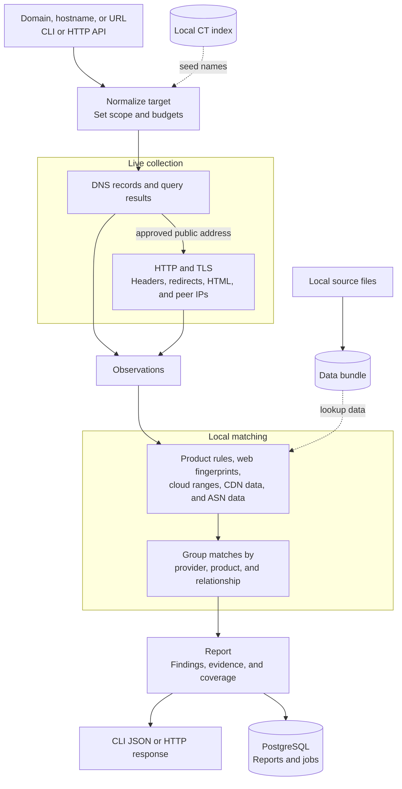

# cloudattrib

`cloudattrib` checks a domain's DNS records, HTTP responses, TLS certificates, and IP addresses. It returns cloud and SaaS matches with the records that produced them.

Rules and IP lookups run from local data. Domain analysis contacts the configured DNS resolver and the target website.

## Run it

Install Go 1.25 or later and Make, then build the binary:

```sh
make build
./bin/cloudattrib analyze example.com
```

Domain analysis needs a recursive DNS resolver. The default address is `127.0.0.1:53`. To use another resolver, set `CLOUDATTRIB_RESOLVER`:

```sh
CLOUDATTRIB_RESOLVER=192.168.1.1:53 ./bin/cloudattrib analyze example.com
```

The command writes JSON to stdout. A shortened report looks like this:

```json
{
  "target": {
    "canonical": "example.com"
  },
  "status": "complete",
  "findings": [
    {
      "subject": "www.example.com",
      "provider_id": "aws",
      "product_id": "aws.cloudfront",
      "relation": "web_delivery",
      "strength": "strong",
      "evidence_ids": ["fixture-cname-cloudfront"]
    }
  ],
  "coverage": [
    {
      "capability": "dns",
      "status": "complete"
    }
  ]
}
```

If a lookup fails or a local data file is missing, `status` is `partial` and `coverage` names the affected lookup.

## How it works



## Other commands

```sh
# Skip HTTP and TLS
./bin/cloudattrib analyze example.com --mode dns

# Analyze a file of targets
./bin/cloudattrib batch --input domains.txt --format jsonl

# Look up an IP address in local data
./bin/cloudattrib lookup-ip 198.51.100.7 --match all

# Run the API and job workers
./bin/cloudattrib serve --config config/example.yaml
```

`reclassify` runs saved observations against another data bundle without contacting the target:

```sh
./bin/cloudattrib reclassify --report report.json --bundle builtin-rules-v1
```

## Add local data

Put source files in `data/sources`, or set `data.source_directory` in the configuration file. For ASN lookups, add these files:

```text
data/sources/iptoasn-v4.tsv
data/sources/iptoasn-v6.tsv
```

See the [source contracts](docs/source-contracts.md) for the supported files and formats. See the [operations guide](docs/operations.md#import-and-activate-data) to import and activate a data bundle.

## Configure it

Set `CLOUDATTRIB_CONFIG` to a YAML or JSON configuration file. Use `CLOUDATTRIB_RESOLVER` to override its DNS resolver. [config/example.yaml](config/example.yaml) contains every setting.

Certificate Transparency discovery uses a local PostgreSQL index. Follow [CT operations](docs/ct-operations.md) to import certificates or collect from a configured log.

## Documentation

- [Operations](docs/operations.md)
- [Architecture](docs/architecture.md)
- [Data source formats](docs/source-contracts.md)
- [Specification](SPEC.md)

## Develop

Run the repository checks before submitting a change:

```sh
make check
```

Set `CLOUDATTRIB_POSTGRES_TEST_DSN` to a disposable PostgreSQL database to include the integration tests.
