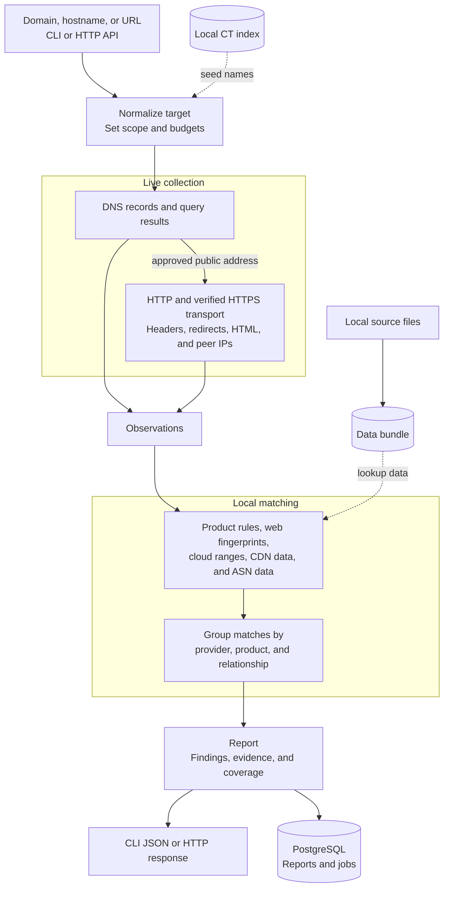

# cloudattrib

`cloudattrib` checks a domain's DNS records, HTTP responses, and IP addresses. HTTPS collection verifies the server certificate but does not yet retain certificate evidence. Reports mark TLS certificate collection unavailable instead of treating a successful handshake as certificate inspection.

Rules and IP lookups run from local data. Domain analysis contacts the configured DNS resolver and the target website.

## Measured on TypeSafe and GitLab

On 2026-09-21, we measured hostname discovery and DNS enrichment, then compared DNS-only and full analysis on the names that resolved.

**Built-in Certificate Transparency discovery is experimental and has not yet been tested against live CT logs.** We therefore used crt.name to discover hostnames, then checked every returned name through Cloudattrib's DNS API.

Discovery and DNS enrichment covered every discovered hostname:

| Domain | Names discovered | Names with addresses | Total time |
| --- | ---: | ---: | ---: |
| `typesafe.ai` | 9 | 9 | 10.33 s |
| `gitlab.com` | 747 | 143 | 52.70 s |

Total time sums the separately timed discovery and DNS stages. The remaining 604 GitLab names had no address at measurement time.

For names with addresses, we ran a fresh DNS-only baseline and full analysis. Full analysis also fetches websites, follows redirects, and runs HTTP rules and technology fingerprints.

| Domain | DNS-only time | Full analysis time | Findings, DNS-only → full |
| --- | ---: | ---: | ---: |
| `typesafe.ai` | 0.20 s | 2.62 s | 19 → 61 |
| `gitlab.com` | 2.62 s | 52.64 s | 430 → 1,168 |

Added fingerprints included Next.js, Vercel, and Ruby on Rails for TypeSafe, and Google Cloud services, CloudFront, and Marketo for GitLab. Counts include repeated findings across hosts and redirects, not unique vendors.

All 9 TypeSafe reports completed. GitLab produced 128 complete reports and 15 partial reports due to HTTP collection failures. No DNS finding disappeared in the full-analysis comparison.

Both runs used the local API at `a504ec0`, resolver `192.168.50.211:53`, four concurrent analyses, the same datasets, and PostgreSQL persistence. Startup is excluded from all timings; discovery is excluded from the follow-up comparison. These are single-run network measurements, not a load test.

Raw results: [discovery and DNS](docs/benchmarks/2026-09-21-company-api-measurements.json), [full-analysis comparison](docs/benchmarks/2026-09-21-subdomain-full-measurements.json).

## Run it

Install Go 1.25 or later and Make, then build the binary:

```sh
make build
./bin/cloudattrib analyze example.com
```

Domain analysis needs a recursive DNS resolver. The default address is `127.0.0.1:53`. To use another resolver, set `CLOUDATTRIB_RESOLVER`:

```sh
CLOUDATTRIB_RESOLVER=192.168.1.1:53 ./bin/cloudattrib analyze example.com
```

URL targets must be query-free. Cloudattrib rejects caller-supplied query values before collection or durable job storage because this release has no restricted credential-storage path for retryable URL queries.

The command writes JSON to stdout. A shortened report looks like this:

```json
{
  "target": {
    "canonical": "example.com"
  },
  "status": "complete",
  "findings": [
    {
      "subject": "www.example.com",
      "provider_id": "aws",
      "product_id": "aws.cloudfront",
      "relation": "web_delivery",
      "strength": "strong",
      "evidence_ids": ["fixture-cname-cloudfront"]
    }
  ],
  "coverage": [
    {
      "capability": "dns",
      "status": "complete"
    }
  ]
}
```

If a lookup fails or a local data file is missing, `status` is `partial` and `coverage` names the affected lookup.

## How it works



## Other commands

```sh
# Skip HTTP and HTTPS
./bin/cloudattrib analyze example.com --mode dns

# Analyze a file of targets
./bin/cloudattrib batch --input domains.txt --format jsonl

# Look up an IP address in local data
./bin/cloudattrib lookup-ip 198.51.100.7 --match all

# Run the API and job workers
./bin/cloudattrib serve --config config/example.yaml
```

`reclassify` runs saved observations against another data bundle without contacting the target:

```sh
./bin/cloudattrib reclassify --report report.json --bundle builtin-rules-v1
```

## Add local data

Put source files in `data/sources`, or set `data.source_directory` in the configuration file. You can load any supported subset. Missing sources produce partial coverage instead of an empty successful lookup.

```text
data/sources/
├── cloudranges/
│   └── json/
│       ├── <provider>.json
│       └── <provider>-details.json
├── aws-ip-ranges.json
├── gcp-cloud.json
├── azure-service-tags.json
├── cdncheck-sources-data.json
├── iptoasn-v4.tsv
└── iptoasn-v6.tsv
```

Keep each `disposable/cloud-ip-ranges` primary file and its optional `*-details.json` companion from the same pinned revision. Primary files create provider associations. Companion files only add validated metadata to matching provider prefixes, so the importer never treats them as duplicate providers.

The broad feed retains recently retired prefixes. The importer joins `retired_at` records by provider and canonical prefix, and normal analysis and IP lookup exclude those associations. An API lookup with `include_retired: true` returns them with their retirement time and source provenance. Historical matches do not claim current ownership.

See the [source contracts](docs/source-contracts.md) for the supported files and formats. See the [operations guide](docs/operations.md#import-and-activate-data) to import and activate a data bundle.

## Configure it

Set `CLOUDATTRIB_CONFIG` to a YAML or JSON configuration file. Use `CLOUDATTRIB_RESOLVER` to override its DNS resolver. [config/example.yaml](config/example.yaml) contains every setting.

Service mode keeps at most `limits.maximum_resident_generations` bundle analyzers in memory. The default is 4, and the minimum is 2 so that the service can load a replacement while it keeps the last-known-good generation available. See [bundle residency](docs/operations.md#control-bundle-residency) for the ownership and metrics contract.

Certificate Transparency discovery uses a local PostgreSQL index. Follow [CT operations](docs/ct-operations.md) to import certificates or collect from a configured log.

## Documentation

- [Operations](docs/operations.md)
- [Architecture](docs/architecture.md)
- [Data source formats](docs/source-contracts.md)
- [Specification](SPEC.md)

## Develop

Run the repository checks before submitting a change:

```sh
make check
```

Ordinary `go test` and `make check` runs skip PostgreSQL integration tests when no test database is configured. To run the required PostgreSQL lifecycle and contention suite, set `CLOUDATTRIB_POSTGRES_TEST_DSN` to a disposable database and run:

```sh
make test-postgres
```

`make test-postgres` fails when the variable is unset or the database is unavailable. CI runs this command against a disposable PostgreSQL service.
