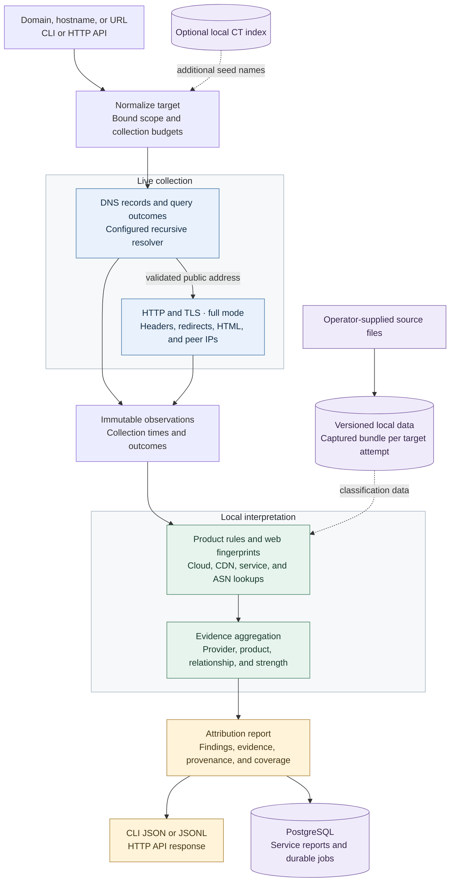

# cloudattrib

`cloudattrib` is a self-hosted Go application for collecting public evidence about cloud infrastructure and SaaS products associated with a domain, hostname, URL, or IP address.

The behavior and delivery boundaries live in [SPEC.md](SPEC.md). The staged repository structure and implementation gates live in [IMPLEMENTATION-PLAN.md](IMPLEMENTATION-PLAN.md).

## How attribution works

Domain analysis combines live observations with local rules and datasets to produce evidence for lead enrichment.



HTTP starts when an approved public address becomes available while remaining DNS queries continue.
Connections use that exact address with the original Host and TLS SNI; redirects receive the same destination checks.
Missing sources remain visible in coverage, and useful evidence survives in a partial report.

`lookup-ip` uses local indexes without collection. `reclassify` interprets retained observations with a selected bundle without making network requests.
Dataset updates and optional CT ingestion run separately from analysis. See the [architecture contracts](docs/architecture.md) for lifecycle and provenance details.

## Development

Install Go 1.25 or later and Make. Run the full local check with:

```sh
make check
```

Useful individual targets are `make build`, `make test`, `make race`, `make lint`, and `make fmt`.

The executable is written to `bin/cloudattrib`. Domain analysis uses the explicit resolver at
`127.0.0.1:53` by default. Set `CLOUDATTRIB_RESOLVER` to another `host:port` when the operator
has configured a different recursive resolver. Target HTTP connections use only concrete
addresses returned by that resolver and apply the public-destination policy.

```sh
cloudattrib analyze example.com --mode dns
cloudattrib analyze example.com
cloudattrib batch --input domains.txt --format jsonl
cloudattrib lookup-ip 198.51.100.7 --match all
cloudattrib reclassify --report report.json --bundle builtin-rules-v1
cloudattrib ct import --input ct-records.jsonl --scope example.com
cloudattrib ct collect --config ct-log.json
cloudattrib serve --config config/example.yaml
cloudattrib datasets import --config config/example.yaml --source-dir data/sources
cloudattrib datasets status --config config/example.yaml
```

The built-in execution view supports DNS, bounded HTTP, reviewed product rules, passive web
fingerprints, and offline reinterpretation of a standalone report. Local prefix and ASN lookup
loads the active bundle when one is present. Without an active bundle, it loads the configured
`data.source_directory` (default `./data/sources`) directly. Reclassification preserves the
original observations and collection coverage while recording a new classification time and
bundle identity. It re-evaluates retained DNS addresses and actual HTTP peers, including external
redirect peers, against the selected prefix and ASN data without making network requests.

## CLI setup

The CLI reads `./data/sources` by default. Set `CLOUDATTRIB_CONFIG` to use a YAML or JSON config
file, or pass `--config` to `datasets` commands. Set `CLOUDATTRIB_RESOLVER` to override the
configured resolver address. The default is `127.0.0.1:53`.

Place supported source files in the configured source directory. For local ASN lookup, provide
`iptoasn-v4.tsv` and `iptoasn-v6.tsv`. Each file must contain five tab-separated fields per line:
the inclusive start address, inclusive end address, unsigned decimal ASN, country code, and
description. IPv4 uses unsigned integer start and end values. IPv6 uses literal IPv6 addresses.
Intervals must be ordered and must not overlap.

Run a local lookup or analysis with the configured sources and resolver:

```sh
cloudattrib lookup-ip 8.8.8.8 --match all
CLOUDATTRIB_RESOLVER=127.0.0.1:53 cloudattrib analyze example.com --mode dns
```

An active bundle takes precedence over the configured source directory. The application does not
download or refresh source data during startup or request processing. Missing source files reduce
coverage. A lookup can return available associations with partial coverage; if no applicable source
is usable, it returns `capability_unavailable`.

Command-specific `--config` flags on `serve` and `datasets` override `CLOUDATTRIB_CONFIG` for that
operation.

Certificate Transparency support is optional and disabled by default. It uses a local PostgreSQL
index and never performs request-time CT searches. See [CT operations](docs/ct-operations.md) for
the import schema, pinned-log collector, verification boundary, and measured operating envelope.

The [operations guide](docs/operations.md) covers the pinned Compose and systemd deployments,
dataset staging/activation/rollback, monitoring, backup/restore, network separation, and offline
build/update procedures. Third-party identities and unresolved data-redistribution questions are
recorded in [the SBOM](sbom/cloudattrib.cdx.json), [notices](NOTICE.md), and
[dependency audit](docs/dependency-audit.md). Measured compatibility, latency, release checks, and
R01–R23 evidence are recorded in the [qualification report](docs/qualification.md).

## Agent skills

Go development guidance lives in `.agents/skills`. Run `make skills-check` to verify the package inventory and recorded content hashes.
